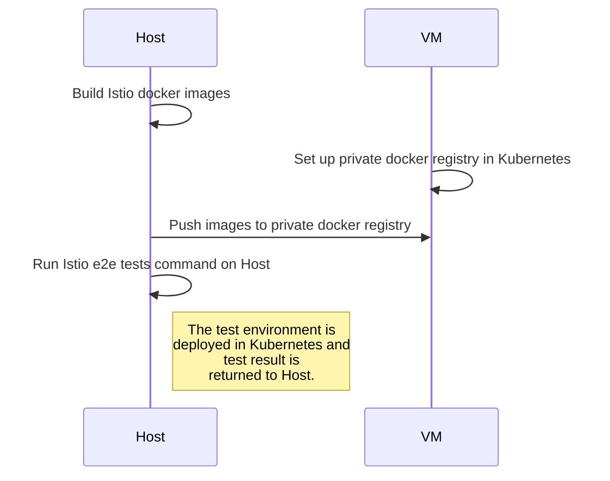
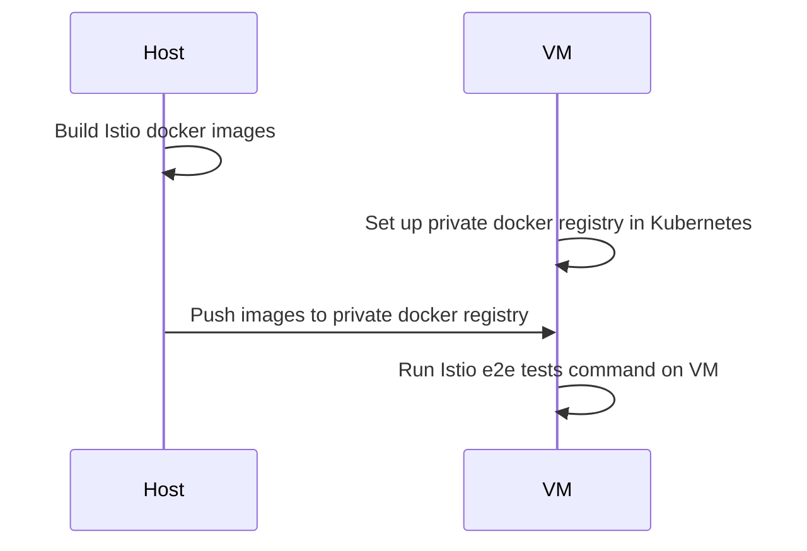

# vagrant-kubernetes-istio

Set up Kubernetes on VM with vagrant for Istio testing.

# [RunTestOnHost](https://github.com/JimmyCYJ/vagrant-kubernetes-istio/tree/master/RunTestOnHost "RunTestOnHost")

# [RunTestOnVm](https://github.com/JimmyCYJ/vagrant-kubernetes-istio/tree/master/RunTestOnVm "RunTestOnVm")

